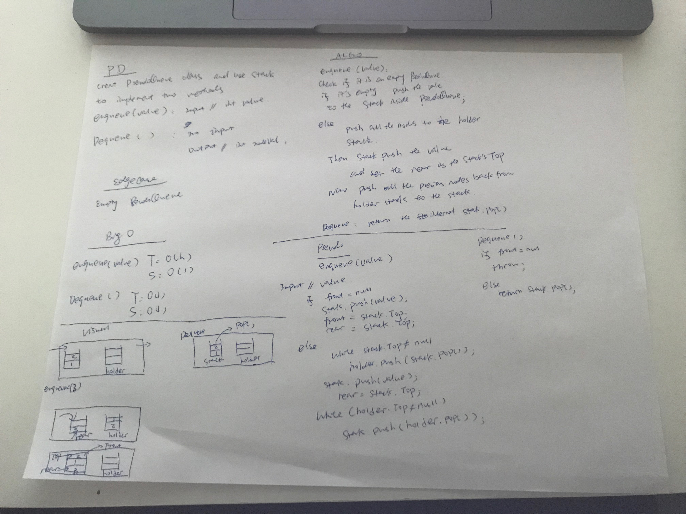

# **Stacks with Queues**

# Challenge Summary

Create a brand new PseudoQueue class. Do not use an existing Queue. Instead, this PseudoQueue class will implement our standard queue interface 

## Challenge Description
enqueue(value) which inserts value into the PseudoQueue, using a first-in, first-out approach.

dequeue() which extracts a value from the PseudoQueue, using a first-in, first-out approach.

The Stack instances have only push, pop, and peek methods. You should use your own Stack implementation. Instantiate these Stack objects in your PseudoQueue constructor.

## Approach & Efficiency

Enqueue(value) : BigO: 
                       Time:O(h)
                       Space:O(1)

Dequeue() :      BigO:
                       Time:O(1)
                       Space:O(1) 
                
                 

## Solution
<!-- Embedded whiteboard image -->
