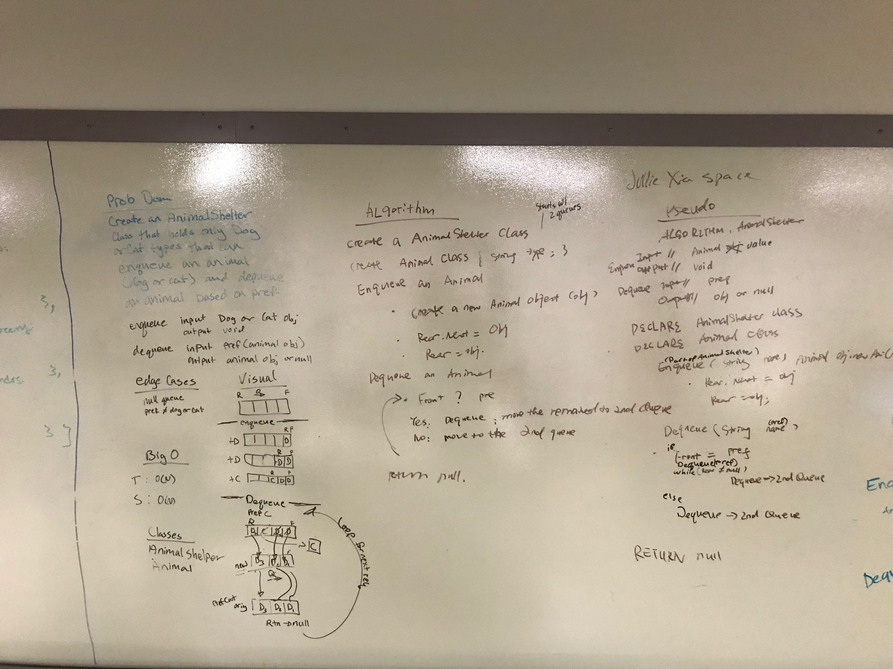

# Fifo Animal Shelter

## Challenge
Create a class called AnimalShelter which holds only dogs and cats. The shelter operates using a first-in, first-out approach.

enqueue(animal): adds animal to the shelter. animal can be either a dog or a cat object.

dequeue(pref): returns either a dog or a cat. If pref is not "dog" or "cat" then return null.

## Approach & Efficiency

T<-O(n)

S<-O(n)

#### whiteboard

