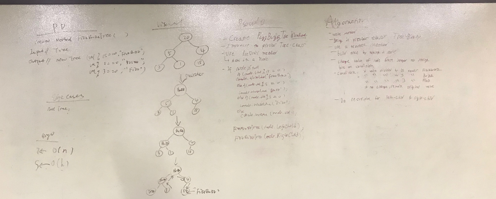

# FizzbuzzTree 

]Write a function called FizzBuzzTree which takes a tree as an argument. Without utilizing any of the built-in methods available to your language, determine weather or not the value of each node is divisible by 3, 5 or both, and change the value of each of the nodes: If the value is divisible by 3, replace the value with “Fizz” If the value is divisible by 5, replace the value with “Buzz” If the value is divisible by 3 and 5, replace the value with “FizzBuzz”

# Approach and Effiency

Approach: Node class: make the value type as Object
          FizzBuzzTree: take in the tree root and tree as a input and check if the value can be divided by 3/5/15
          then make certain changes to the value ("Fizz","Buzz","FizzBuzz")
          then call the function itself to pass in its left child if left child not null and pass in the tree as well
          then call the function itself to pass in its right child if right child not null and the tree
          after all the changes return the modified tree.
        

Big o

T<- O(n) S<- O(H)

#whiteboard

