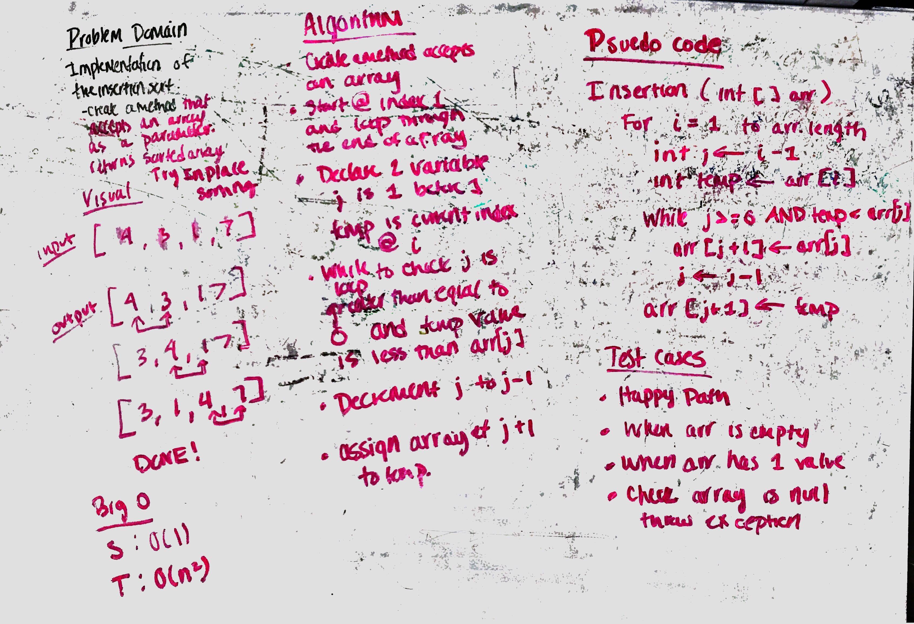

# Insertion Sort

Insertion sort is a simple sorting algorithm that works the way we sort playing cards in our hands. We compare the next value with the former values and isnert into the list.

## Learning Objectives
Write a function for insertion sort that takes in an unsorted array and returns the array sorted using insertion sort

Tests inculde: A randomly generated unsorted array returns the array sorted A sorted array returns the same sorted array A backwards-sorted array returns the array sorted An empty array returns the same empty array An array of one element returns the same single-element array

## Lecture Flow

Compare the values next to each other and sort them and move on to the next value till the end.

## Diagram

## Algorithm

Approach: traverse the array and compare the neighbours, swap them if needed and return the original array

Bigo T->(n) 
     S->O(1)

## Psedo Code
InsertionSort(int[] arr)
  
    FOR i = 1 to arr.length
    
      int j <-- i - 1
      int temp <-- arr[i]
      
      WHILE j >= 0 AND temp < arr[j]
        arr[j + 1] <-- arr[j]
        j <-- j - 1
        
      arr[j + 1] <-- temp
      
      

     
     
