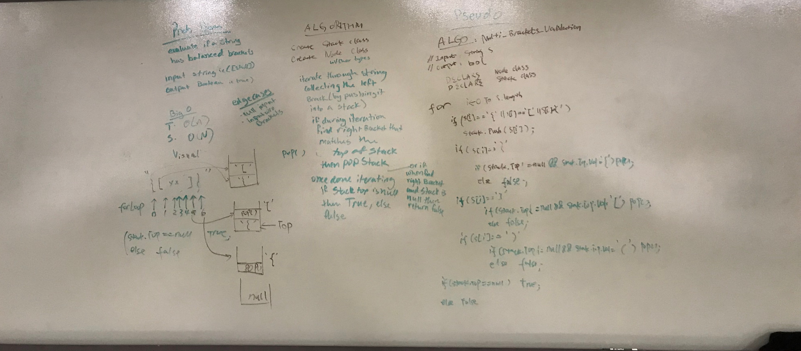

# Multi-bracket-validation

Check if a sting contains validated brackets.

Input	Output {}	TRUE

{}(){}	TRUE

()[[Extra Characters]]	TRUE

(){}[[]]	TRUE

{}{Code}(())	TRUE

[({}]	FALSE

(]( FALSE

{(})	FALSE

## Challenge
Your function should take a string as its only argument, and should return a boolean representing whether or not the brackets in the string are balanced. There are 3 types of brackets:

Round Brackets : () Square Brackets : [] Curly Brackets : {}

{	FALSE	error unmatched opening { remaining.

)	FALSE	error closing ) arrived without corresponding opening.

[}	FALSE	error closing }. Doesn’t match opening (.

## Approach & Efficiency

Approach:
Travere the string,u sing a stack (java.util) to store all the left brackets exsist in the string,
if hit the right bracket, check the top value of the stack see if the left bracket on the top of the stack matches the one hit in the loop
if matches pop the one from stack, if not return false right away, in the end (after the loop) if there are still left brackets left in the stack, return false else return true.

Big O:
Space: o(H) (H- stack height)

Time:  O(n)

## Whiteboard Image

