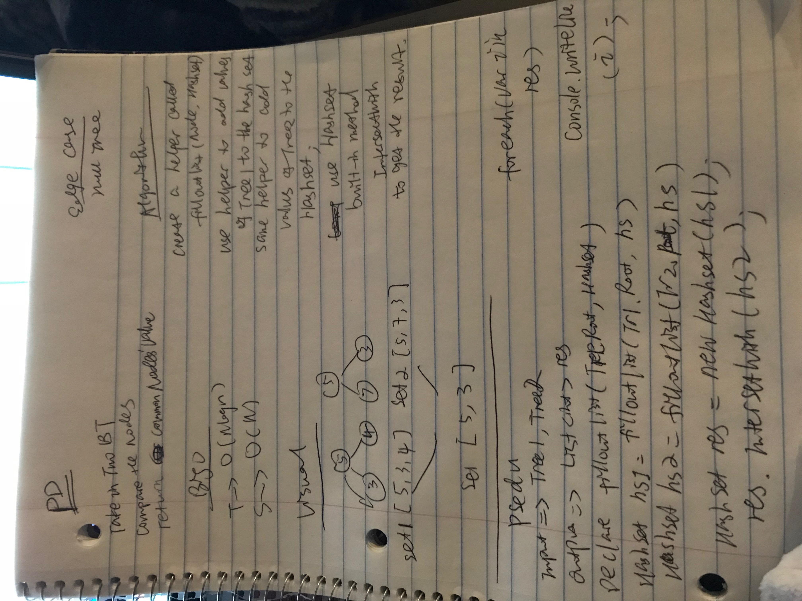

## TreeIntersection

Take in two binary tree and compare their nodes' value, print out all the common nodes' value

### Challenge
Write a function called tree_intersection that takes two binary tree parameters.

Without utilizing any of the built-in library methods available to your language, return a set of values found in both trees.

### Approach & Efficiency
store the node value in lists, and compare two lists, add common value to a result list, and after for loop return the result list.

BigO

T->O(nlogn) recursive function to fill out the lists and for loop to traversal the list.

S->O(n) created new lists.

