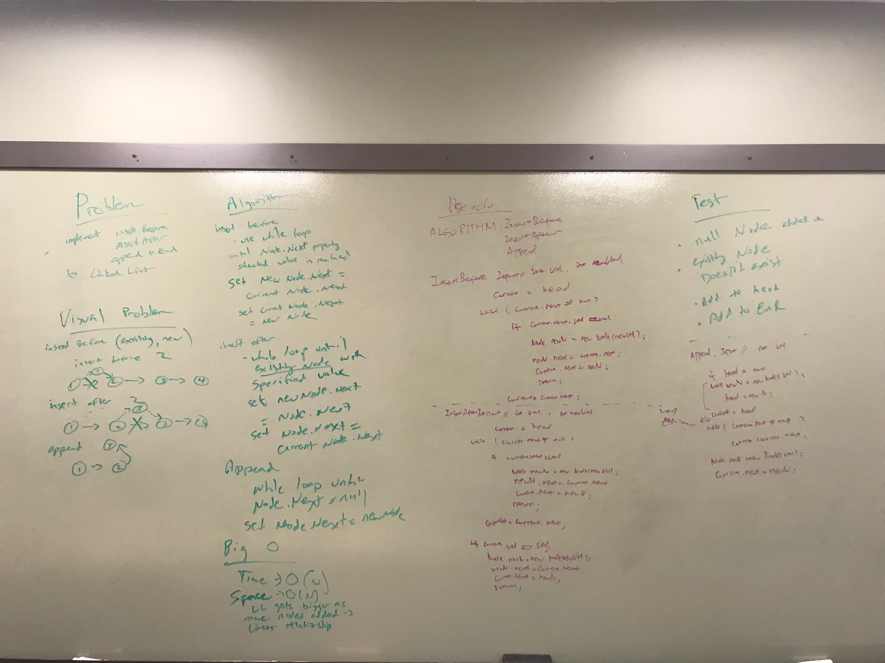

**Linked List**

Create a Node class that has properties for the value stored in the Node, and a pointer to the next Node.

Within LinkedList class, include a head property. Upon instantiation, an empty Linked List should be created.

This object should be aware of a default empty value assigned to head when the linked list is instantiated.

Insert : takes any value as an argument and adds a new node with that value to the head of the list with an O(1) Time performance.

          Time: Big O=O(1); Space:O(1);

Includes: takes any value as an argument and returns a boolean result depending on whether that value exists as a Node’s value somewhere within the list.
          `Time: Big O = O(n) ; Space: O(1)`

Print: takes in no arguments and outputs all of the current Node values in the Linked List.

           Time: Big O=O(n);Space: O(n)
           
           
Append: Add the value to the end of the list
           
            Time: Big O=O(n); Space:O(n);
               
           
InsertBefore: Insert a node with new value in front of some specific node.
           
           	Time: Big O=O(n); Space:O(n);
           
InsertAfter: Insert a node with new value in front of some specific node.
           
             Time: Big O=O(n); Space:O(n);
             

kthFromEnd: Get kth value from the Linked list: Take in a integer k , return the kth Node's value from the Linked List
             `Time: Big O=O(n^2); Space:O(1);`
             
             
Whiteboard Image 

