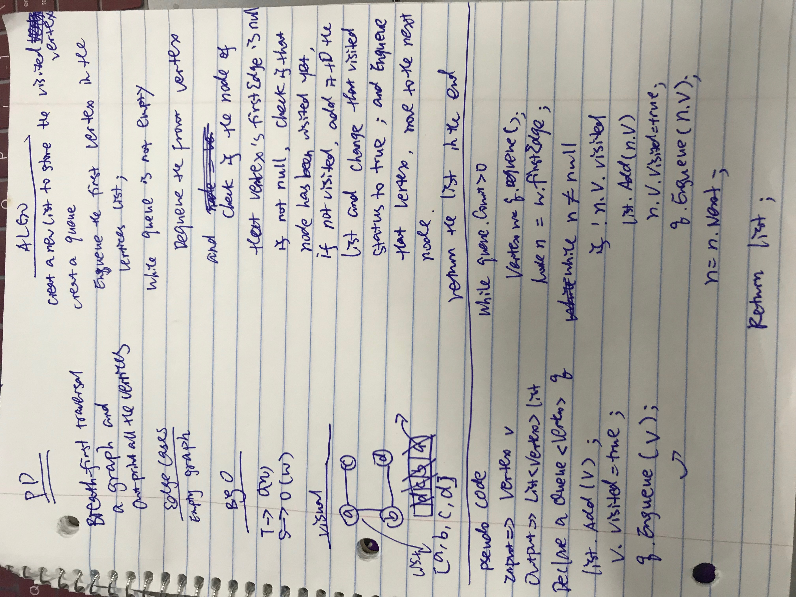

## Graphs
A graph is a set of vertices and a collection of edges that each connect a pair of vertices. It can be complete or connected or disconnected. It can have weights between nodes and some node can go back to itself.

## Challenge
Implement your own Graph. The graph should be represented as an adjacency list, and should include the following methods:

AddNode()

Adds a new node to the graph Takes in the value of that node Returns the added node

AddEdge()

Adds a new edge between two nodes in the graph Include the ability to have a “weight” Takes in the two nodes to be connected by the edge Both nodes should already be in the Graph

GetNodes()

Returns all of the nodes in the graph as a collection (set, list, or similar)

GetNeighbors()

Returns a collection of nodes connected to the given node Takes in a given node Include the weight of the connection in the returned collection

Size()

Returns the total number of nodes in the graph

BFStraversal()

Extend graph object with a breadth-first traversal method that accepts a starting node.

Without utilizing any of the built-in methods available to your language, return a collection of nodes in the order they were visited.

Display the collection.

## Approach & Efficiency
### Approach:
Vertex class: includes its data(value), firstEdge (the first connected Node with the Vertex), visited(boolean type, not used for now)

Node class: includes its Vertex(which vertex the node connect with) , its next Node, its weight

Graph class: include a list of Vertices (type is Vertex)

AddNode(string val): check the list of Vertices first see if the node alreadt exsits, if not create new Vertex and add it to the vertices;

AddEdge(Vertex v1,Vertex v2, int weight): check if the V1 has firstEdge, if not create new Node with v2 and weight; if the v1's fisrtEdge's data equals to v2's data, it means the edge between these two Vertex already exsits, otherwise add node (v2) to the last postion of the list

GetNodes():return the Vertices (List);

GetNeighbors(Vertex n): create new List<(string,int)> for neighbors, find the index of vertex n in the Vertices list, and find its fistEdge node, add node's data and its weight to the neighbors and point to the next node until the last node

size(): this will return the list's size which is list.Count;

BFSTraversal(): using Queue to store the vertices, if not visisted enqueue that vertex,if already visited, add the vertex to the list and return the list in the end

Depth First Traversal
Imaging graph like a tree, take in one Vertex, and bring all the nodes in the graph.

Challenge
Create a function that accepts an adjacency list as a graph, and conducts a depth first traversal.

Without utilizing any of the built-in methods available to your language,

return a collection of nodes in their pre-order depth-first traversal order.

Approach & Efficiency
Approach: Take in the first Vertex in the graph, and set it visited proptery as True, then outprint its data(value), then get its firstEdge(the node connect to it directly)

node and check if the node is null, and if the vertex connext to it has been visted or not, if already visited, call DFS function else just

move on to next node and till the end

Effiency: T->O(n) you have to go through every node in the graph S->O(H) i am doing recursion so it will be height of call stack

### Efficiency:
Big O

Space: O(n), assume the graph will have some numbers of nodes

Time: O(n), worst case will go through every node in the graph

Image for BFSTraversal

