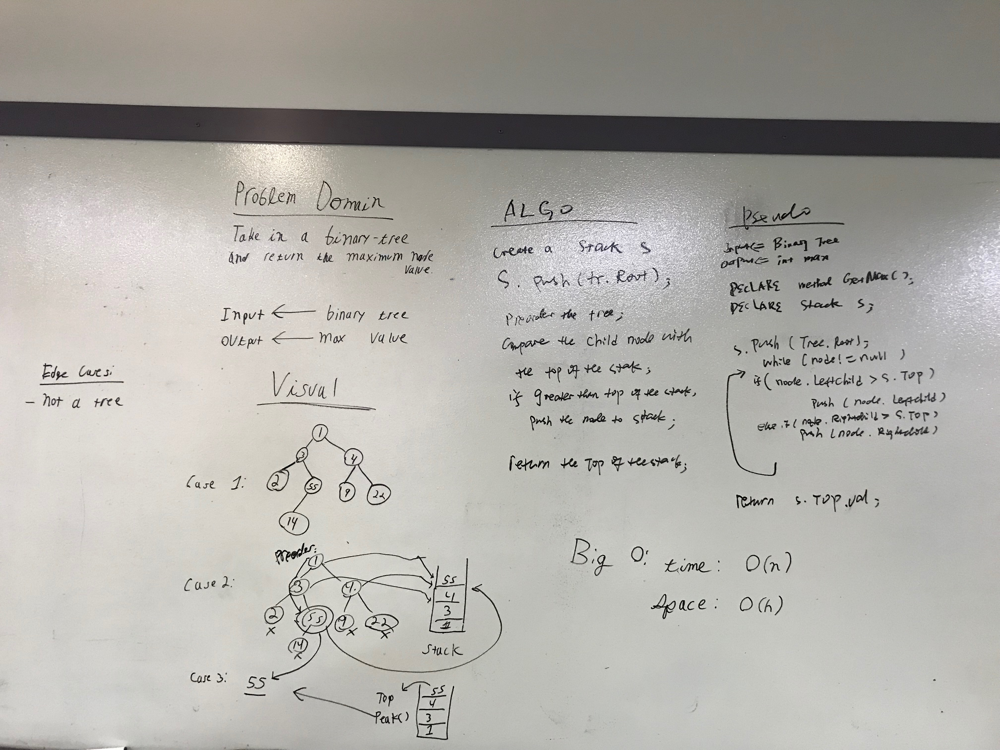

# Tree

This includes one parent class: Tree and two children classes: BT and BST

Two types of Trees: BinaryTree, BinarySearchTree

BinaryTree:In computer science, a binary tree is a tree data structure in which each node has at most two children, which are referred to as the left child and the right child.

BinarySearchTree: It is a node-based binary tree data structure which has the following properties: The left subtree of a node contains only nodes with keys lesser than the node’s key. The right subtree of a node contains only nodes with keys greater than the node’s key. The left and right subtree each must also be a binary search tree.

## Challenge

For BinaryTree Part Create a Node class that has properties for the value stored in the node, the left child node, and the right child node. Create a BinaryTree class Define a method for each of the depth first traversals called preOrder, inOrder, and postOrder which returns an array of the values, ordered appropriately(inorder,preorder,postorder from parent class).

For BinarySearch Part, it defines a method named add that accepts a value, and adds a new node with that value in the correct location in the binary search tree. Define a method named contains that accepts a value, and returns a boolean indicating whether or not the value is in the tree at least once.

Breadth-first-traversal:   traverse the tree each level and print out the each level's value

## Approach & Efficiency

Big O

Binary search Tree:

T<-O(logn)

S<-O(h)

Binary Tree:

T<-O(logn)

S<-O(h)

Breadth-first-traversal: T<-O(n) S<-O(W)

Find Max Value In BinaryTree: T<-O(n), S<-O(n)

### Api

In the BinarySearchTree class

addRecursive method should be privte and so is containsVal method.

### whiteboard image for breadth-first method

## breadth-first

## max value in Binary Tree
